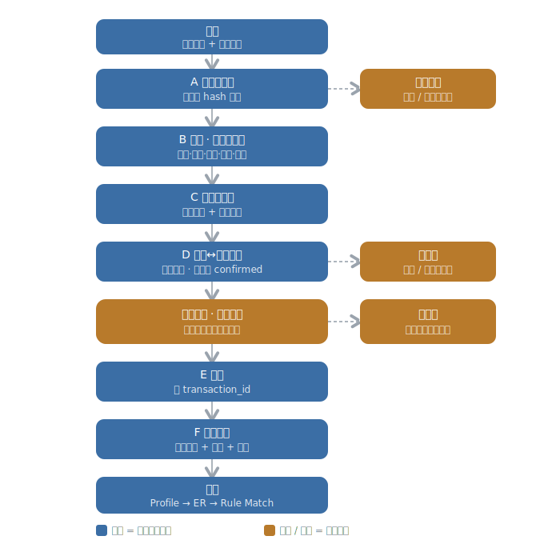

# Evidence Intake · L3 Schema

> **状态**：字段级 schema 工作稿（draft，非冻结正式契约）。
> **内容**：① 节点子流程图（六块 + 一闸门）；② 锁定字段清单；③ 各块「吃进 / 吐出 / 留名」结果。
> **口径**：字段名已与 owner 逐项确认。内部执行序列、enum 精确取值、写入 / finalization 机制等仍属 L4 / 未冻结，不在此定。
> **来源**：`BK_Copilot/workflow_nodes/evidence_intake_node/01·02` ＋ `L2/L2_proposals/Evidence Intake__L2提案.md`。

---

## 一、节点子流程（六块 + 一闸门）

**冻结的顺序约束**：余额链体检（C）在证据配对（D）之前 · 铸号（E）在放行闸门之后 · 闸门覆盖 A→D 的资格。
**贯穿铁律**：全量保全，不删不丢——挡下的材料只是不进交易流，不会被丢弃。

---

## 二、锁定字段清单

### 主干交易字段（跟着干净交易往下游走）

**① 交易事实**

| 字段名 | 含义 | 出生块 | 动作 |
| --- | --- | --- | --- |
| `amount` | 金额，绝对值（正负由 direction 表达） | B | remake |
| `direction` | 资金方向：进 / 出（内部取值口径待与 Rule Match / JE 统一） | B | remake |
| `transaction_date` | 交易日期 | B | remake |
| `source_account` | 来源账户标识（原文级，非会计科目、非 Profile 账户） | B | remake |
| `currency` | 币种 | B | remake |
| `raw_description` | 原文描述，照抄留底 | B | remake |

**② 锚与溯源**

| 字段名 | 含义 | 出生块 | 动作 |
| --- | --- | --- | --- |
| `transaction_id` | 交易唯一编号（整条链的锚） | E | create |
| `evidence_refs` | 回到源材料的追溯指针（"属于哪张账单"靠它） | A | create |
| `source_channel` | 来源渠道：runtime / onboarding / supplemental | A | create |
| `evidence_type` | 证据类型：账单 / 收据 / 支票 / 发票 / 合同 / 留言 | A | create |

**③ 证据基础（随交易传给 ER）**

| 字段名 | 含义 | 出生块 | 动作 |
| --- | --- | --- | --- |
| `evidence_association` | 证据↔交易配对结果（confirmed 的随交易走） | D | create |
| `counterparty_signals` | 对手方表面线索（流向 ER 认身份） | D | create |

### 旁路信号字段（不跟交易走，分流到别处）

| 字段名 | 含义 | 出生块 | 去向 | 类型 |
| --- | --- | --- | --- | --- |
| `statement_chain_status` | 账单链状态：连续 / 缺口 / 重叠 / 无法验证 | C | 目标层 | 状态 |
| `coverage_signal` | 缺月 / 重叠账单信号 | C | 目标层 | 信号 |
| `duplicate_material_signal` | 文件级重复信号 | A | 纠错 / 材料层 | 信号 |
| `content_fingerprint` | 文件内容指纹（查重键；供 `duplicate_material_signal` 指明"重复于哪个文件"） | A | 材料层 | 键 |
| `quality_issue_signal` | 证据质量问题信号（A/C/D 各处冒出、F 汇总移交） | F | Coordinator / Review | 信号 |

---

## 三、分块分析（吃进 / 吐出 / 留名）

### A · 收料与查重

- **吃进**：原始材料文件（银行流水 / 收据 / 支票 / 发票 / 合同 / 留言）；批次来源上下文（runtime / onboarding / supplemental）；已存在证据引用（只读，防重复）
- **吐出**：识别过、非重复的干净材料往 B；每份材料的来源标注、证据类型、回到原文件的指针、文件级重复标记；挡下的异常 / 读不出 / 多余文件 → 保全转证据池或纠错路
- **留名**：`source_channel`、`evidence_type`、`evidence_refs`、`content_fingerprint`、`duplicate_material_signal`

### B · 解析 · 抠客观字段

- **吃进**：A 放过来的干净、已识别材料（主要是银行账单）；每份材料的证据类型标注
- **吐出**：一笔一笔的客观交易事实——金额 / 方向 / 日期 / 来源账户 / 币种 / 原文描述；可追溯靠 `evidence_refs` ＋ 这笔自身字段承载，不另立行级锚点字段
- **留名**：`amount`、`direction`、`transaction_date`、`source_account`、`currency`、`raw_description`

### C · 余额链体检

- **吃进**：B 给的每张账单的行（带符号金额、可能的逐行余额）＋ 账户标识、账期起止、期初 / 期末余额
- **吐出**：每账户的账单链状态（连续 / 缺口 / 重叠 / 无法验证）；缺月 / 重复账单信号；整张账单自洽与否的判定（不自洽 → 整张挂起转纠错路，喂给闸门）
- **留名**：`statement_chain_status`、`coverage_signal`（均为旁路，去目标层）

### D · 证据↔交易配对

- **吃进**：B 给的银行交易行 ＋ 客观字段；原始的非银行证据（收据 / 支票 / 发票 / 合同 / 留言）
- **吐出**：每份证据↔交易的配对结果（confirmed / candidate / 未配，字段打架归 candidate）；对手方表面线索（→ ER）；confirmed 的随放行包并入交易，candidate / 未配 → 证据池
- **留名**：`evidence_association`、`counterparty_signals`

### 闸门 · 放行资格

- **吃进**：B / C / D 的产物——客观字段齐不齐、账单自洽否、可追溯否
- **吐出**：放行 / 挂起判定，按单张账单全有或全无；过 → E 铸号，不过 → 整张挂起转纠错路
- **留名**：无（六项资格全是 B 已留名字段，闸门只判不产新字段）

### E · 铸号

- **吃进**：通过闸门的放行交易（带 B 的客观字段、D 的 confirmed 关联）
- **吐出**：每笔一个永久唯一编号——整条链的锚
- **留名**：`transaction_id`

### F · 打包放行 / 旁路移交

- **吃进**：E 之后的放行交易（全套字段 ＋ 编号）＋ 各类信号 ＋ 被挡下的材料
- **吐出**：放行包（客观事实 ＋ confirmed 关联 ＋ `evidence_refs` ＋ `transaction_id` → Profile → ER → Rule Match）；信号分发（对手方 → ER、账单链 / 缺月 → 目标层、质量问题 → Coordinator / Review）；候选证据 → 证据池、破损材料 → 纠错路
- **留名**：`quality_issue_signal`（旁路）；放行包为容器，不单独立字段
