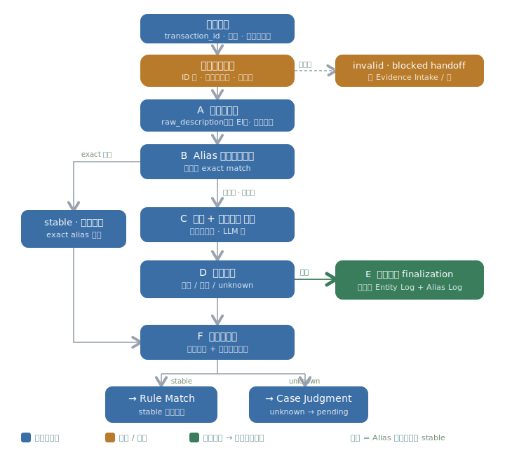

# Entity Resolution · L3 Schema

> **状态**：字段级 schema 工作稿（draft，非冻结正式契约）。
> **内容**：① 节点子流程图（六块 + 一闸门，两条路）；② 锁定字段清单；③ 各块「吃进 / 吐出 / 留名」结果。
> **口径**：字段名已与 owner 逐项确认。运行期表面文字全程 `raw_description`；`alias` 不是运行期字段，只是 stable·新建时写入 Alias Log / Entity Log 的存储记录名。enum 精确取值、alias_record / created_by / 外部来源 exact field schema、写入机制等仍属 L3（对应记忆层）/ L4，不在此定。
> **来源**：`BK_Copilot/workflow_nodes/entity_resolution_node/00·01·02`（2026-06-25 收口后版本）＋ `缺口地图.md` Entity Resolution 段＋本轮决策 `Decisions.md` D1–D7。

---

## 一、节点子流程（六块 + 一闸门，两条路）

**两条路**：① **Alias 确定性路**——B 块 exact 命中即复用既有实体、直达 `stable`，跳过外部搜索与重判；② **证据路**——未完全命中（含仅高度相似）才走 C 的证据 + 外部搜索，再由 D 判 `stable`（复用 / 新建）或 `unknown`。

**冻结的顺序约束**：
1. 入口校验在最前——缺 `transaction_id` / `evidence_refs` 不得进入身份判断。
2. Alias **完全命中是确定性复用**，优先于 LLM 语义匹配；命中即定，不再走 C/D。
3. 新建实体的 **Entity Log + Alias Log 同步 finalization 必须在交易进下游 judgment/pending 之前完成**（E 在 F 路由去下游之前）。

**贯穿铁律**：
- 只答「是谁」——绝不碰 COA / HST / GST、rule、case、JE、最终确认。
- 歧义 / 冲突 / 缺证只能 `unknown` + reason，**不伪造 entity、不选 winner**。
- **alias 是「果」**：身份 stable 才诞生；运行期表面文字一律 `raw_description`，`alias` 只在 stable·新建写入两个 log 时出现。
- 「摘要不能替代 raw ref」：ER 不预加工证据给下游，下游各自读 raw；`identity_evidence_refs` 是指针非内容。
- 除新建实体的同步 finalization 外，ER 不产任何并行候选 / 风险通道（`candidate_signal` 等已删，见 Decisions D1）。

---

## 二、锁定字段清单

### 主干身份输出（随交易往下游 Rule Match / Case Judgment；finalization 时落 Transaction Log）

| 字段名 | 含义 | 出生块 | 动作 |
| --- | --- | --- | --- |
| `identity_state` | 身份状态枚举：`stable` / `unknown` | D（B 命中=set） | create |
| `entity_id` | **输出的 Entity**：stable 实体稳定句柄（指向 Entity Log 记录） | B 命中 / D 复用=read · 新建=E create | set / create |
| `identity_reason` | 可审计身份理由。stable=依据哪些 evidence point（或 "exact alias match"）；unknown=为什么没定（ambiguous/conflict/unresolved/missing evidence/alias issue）+ 诊断线索 | B 命中 / D | create |
| `identity_evidence_refs` | 身份判断用到的证据**指针**；ref 可指内部 Evidence Log 或外部可追溯来源（外部变体；exact schema 留 Stage 3） | D（从 `evidence_refs` 投影 + C 的外部来源） | remake |

### 新建实体落库（仅 stable·新建；E 同步 finalization → Entity Log + Alias Log，exact schema 归对应记忆层 L3）

| 字段名 | 含义 | 出生块 | 动作 |
| --- | --- | --- | --- |
| `created_by` | 此 entity 由谁创建（= ER 自动新建，区别于会计师 / 治理建）；替代原 creation_provenance | E | create → save（→ Entity Log） |
| `raw_description` 作为 `alias` | 这次原文 → 新 `entity_id` 的确认绑定；写 Alias Log（alias→entity 反查 projection）+ Entity Log（初始 alias surface） | E | create → save（alias_record schema 归 Alias Log L3） |

### 旁路信号字段

无。（原 `candidate_signal` / `merge_split_candidate` / `alias_conflict_issue` / `identity_governance_issue` / `blocking_reason` / `identity_risk_flags` 已删，见 Decisions D1。）

### 读取 / 透传输入（上游已留名，ER 只 read/pass，不在此造名）

`transaction_id`（EI，pass，全程锚）· `raw_description`（EI，read/pass；运行期唯一表面文字名，unknown 时输出它）· `evidence_refs`（EI，read，身份取证基础）· `counterparty_signals`（EI，read，对手方线索）· `evidence_association` / 客观交易事实（EI，read，随交易）· `structural_path_status` + 非结构原因（Profile，read，触发前置）· Entity Log（实体 / status / risk_flags / automation_policy）/ Alias Log / Governance Log / Intervention Log / Knowledge Summary / 外部搜索（read）。

---

## 三、分块分析（吃进 / 吐出 / 留名）

### 入口资格闸门
- **吃进**：`transaction_id`、`evidence_refs` / 证据基础、客观交易事实（EI）；`structural_path_status` + 非结构原因（Profile）——全 read
- **吐出**：合格放行 → A；不合格 → invalid · blocked handoff（回 Evidence Intake / 停）
- **留名**：无（只判不产字段）

### A · 取银行原文
- **吃进**：EI 的 `raw_description`（read）；`counterparty_signals` + 其它证据（receipt vendor / cheque payee / invoice·contract party）备用（read）
- **吐出**：`raw_description` 给 B 当 Alias 查询键；其它证据留给 C
- **留名**：无（`raw_description` 是 EI 字段，ER read/pass，不另造名）

### B · Alias 完全命中查询（确定性）
- **吃进**：`raw_description`；Alias Log（read）
- **吐出**：**exact 命中** → 该 alias 指向的既有 stable entity → 直接 stable·复用、`identity_reason`="exact alias match"，跳过 C/D；**未命中（含仅高度相似）** → 落证据路 C
- **留名**（命中分支）：`identity_state`=stable（set）、`entity_id`（read 自 alias 指向）、`identity_reason`（create）

### C · 证据 + 外部搜索 认人（仅未命中）
- **吃进**：其它证据（receipt/invoice/contract/cheque）+ `raw_description` 当 clue + 高度相似 alias 当 clue + Entity Log 语义匹配（read）+ AI 外部搜索（read）
- **吐出**：身份线索 + 可追溯外部来源（与证据共指唯一、无实质竞争对象时，可作 stable 证据点）→ 喂 D
- **留名**：无独立字段（外部来源指针并入 D 的 `identity_evidence_refs` 外部变体）

### D · 身份判定（证据路）
- **吃进**：C 的证据线索 + 外部来源 + Entity Log 语义匹配候选
- **吐出**：stable·复用既有（证据清楚指向已有 entity）/ stable·新建 / unknown + reason；歧义·冲突·缺证只能 unknown，不伪造、不选 winner
- **留名**：`identity_state`（create）、`entity_id`（复用=read 自 Entity Log；新建=交 E create）、`identity_reason`（create）、`identity_evidence_refs`（remake，含外部变体）

### E · 新建实体同步 finalization（仅 stable·新建）
- **吃进**：D 判 stable·新建的对象 + `raw_description` + `identity_reason` / evidence + 新 `entity_id`
- **吐出**：进下游前**同步**写 Entity Log（实体本体 + `created_by` + 初始 alias surface = `raw_description`）+ Alias Log（`raw_description` → `entity_id` 的 alias projection）
- **留名**：`entity_id`（create）、`created_by`（create→save）、`raw_description` 作为 `alias` 写入（create→save；alias_record / created_by exact schema 归 Alias Log / Entity Log 的 L3）

### F · 打包与路由
- **吃进**：身份结果（`identity_state` / `entity_id` / `identity_reason` / `identity_evidence_refs`）——来自 B 命中分支或 D
- **吐出**：`stable` → Rule Match；`unknown` → Case Judgment（pending）；`raw_description` + `transaction_id` 全程 pass；`identity_reason` + `identity_evidence_refs` 随交易在 finalization 落 Transaction Log
- **留名**：无（打包容器）
