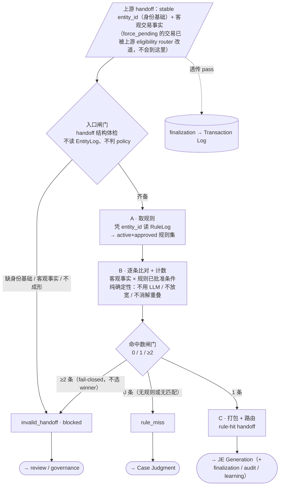

# Rule Match · L3 Schema

> **状态**：字段级 schema 工作稿（draft，非冻结正式契约）。
> **内容**：① 节点子流程图（三块 + 两闸门）；② 锁定字段清单；③ 各块「吃进 / 吐出 / 留名」结果。
> **口径**：字段名已与 owner 逐项确认。RM 是 runtime-only 节点、自身不写任何 log；`force_pending` 在上游 eligibility router 已改道、RM 不读 policy；`rule_id` / `approved_accounting_treatment` 的 exact 形态归 RuleLog / JE Generator L3，`rule_match_outcome` 枚举 / rule-hit handoff schema 归 Stage 3，`classified_by`〔本笔分类由谁做出〕/ `confirmed_by`〔最终结果确认 / 审计〕enum 归 Case Log M3 / Transaction Log L3（见 D11），均不在此定。
> **来源**：`BK_Copilot/workflow_nodes/rule_match_node/00·01·02` ＋ `缺口地图.md` Rule Match 段 ＋ 本轮决策 `Decisions.md` D8（`automation_policy` 拆 `force_pending` / `promotion_lock`）/ D9（`rule_id`）。

---

## 一、节点子流程（三块 + 两闸门）

**冻结的顺序约束**：入口体检在最前（缺身份基础 / 客观事实不得进入匹配）· 取规则（A）在比对（B）之前 · 命中数 `0 / 1 / ≥2 → rule_miss / rule_hit / invalid·blocked` 是冻结语义 · ≥2 一律 fail-closed。

**贯穿铁律**：
- **runtime-only，RM 自身不写任何 log**；命中交易由后续 finalization 落 Transaction Log（[RM 02:51-63](../../BK_Copilot/workflow_nodes/rule_match_node/02_logic_and_boundaries.md)）。
- **纯确定性**：不用 LLM / AI，不重算 rule 资格，不放宽 / 裁剪条件，不消解 overlap，不选 winner（[RM 02:88-103](../../BK_Copilot/workflow_nodes/rule_match_node/02_logic_and_boundaries.md)）。
- **不读 EntityLog、不判 eligibility**：`force_pending` 在上游 router 已改道，RM 只收已放行交易（Decisions D8）。
- **rule authority 在 RuleLog**：RM 只携带命中规则的 `rule_id` + `approved_accounting_treatment`，不生成、不改。

---

## 二、锁定字段清单

### 主干输出字段（命中后随 rule-hit handoff 往下游 JE Generation；trace 随交易落 Transaction Log）

| 字段名 | 含义 | 出生 / 来源块 | 动作 |
| --- | --- | --- | --- |
| `rule_match_outcome` | 结局枚举：`rule_hit` / `rule_miss` / `invalid_handoff·blocked`；节点对下游唯一契约面 | 命中数闸门（入口闸门可早 set 为 invalid） | create |
| `rule_id` | 命中那条 active approved rule 的稳定 id（审计 / 引用 handle，不钉版本，见 D9） | C（值自 RuleLog read 后输出） | read → 输出 |
| `approved_accounting_treatment` | 命中规则带的已批准会计处理（judgment-free 完整），交 JE Generation 直接执行 | C（值自 RuleLog read 后输出） | read → 输出 |
| `classified_by` = `rule_match` | 本笔分类**由谁 / 什么做出** = 规则匹配；RM 命中时 set（与 `confirmed_by`〔最终会计分类结果的确认 / 审计留痕，归 Transaction Log〕分离，见 D11） | C（仅 rule_hit） | set |

### 透传 / 读取输入（上游已留名，RM 只 read/pass，不在此造名）

| 字段名 | 上游 | 在 RM 内 |
| --- | --- | --- |
| `entity_id` | ER | read（查 RuleLog 键）+ 命中时随 handoff 输出（= StableEntity ref） |
| `direction` / `amount` / `transaction_date` / `currency` | EI | read（匹配维度）+ 命中时随 handoff 携带 |
| `transaction_id` | EI | pass（全程锚） |
| `raw_description` | EI | pass（只随 trace，不作匹配条件） |
| `evidence_refs` | EI（交易→源材料指针） | pass（trace / 审计，不匹配） |
| `identity_evidence_refs` / `identity_reason` | ER | pass（RM 不读不处理，透传 → finalization） |

### 旁路信号字段
无。（RM 不产旁路信号；三类结局即其全部对外输出。）

### 本节点不碰 / 已删
- 只读 **RuleLog**；不读 EntityLog / AliasLog / CaseLog / TransactionLog（[RM 02:41-46](../../BK_Copilot/workflow_nodes/rule_match_node/02_logic_and_boundaries.md)）。
- `evidence_condition`（证据充分性无稳定衡量标准，owner 2026-06-26 删）、`transaction_type` / `objective_tags`（全库无产出方，owner 删）——均不进 RM、不挂开口。
- `automation_policy` 已删，拆为 EntityLog `force_pending` / `promotion_lock`（Decisions D8）；二者 RM 都不读——`force_pending` 由上游 eligibility router 消费、`promotion_lock` 由确定性发现 job 消费。

---

## 三、分块分析（吃进 / 吐出 / 留名）

### 入口闸门
- **吃进**：`entity_id`、客观交易事实（`direction` / `amount` / `transaction_date` / `currency` / `transaction_id`）、`raw_description` + 透传脊梁——全 read / pass
- **吐出**：齐备 → 放行进 A；缺身份基础 / 客观事实 / handoff 不成形 → `invalid_handoff·blocked`（早退）
- **留名**：无新字段（只判路由；早退的 invalid 是 `rule_match_outcome` 的早 set，该字段在命中数闸门出生）

### A · 取规则
- **吃进**：`entity_id`；RuleLog（按 entity_id 取 active+approved 规则集，含各条 `rule_id` / applicability / `approved_accounting_treatment`）——read
- **吐出**：候选规则集 → B（空集照走，B 出 0 → miss）
- **留名**：无（规则集是 RuleLog 内容、权威在 RuleLog；命中那条的 `rule_id` / treatment 到 C 才对外）

### B · 逐条比对 + 计数
- **吃进**：客观交易事实；A 的规则集 + 各规则已批准客观条件——read
- **吐出**：命中数（0 / 1 / ≥2）→ 命中数闸门
- **留名**：无（命中数是块内中间结果 = 草稿）

### 命中数闸门
- **吃进**：B 的命中数
- **吐出**：0 → `rule_miss`；1 → `rule_hit`（进 C）；≥2 → `invalid_handoff·blocked`（fail-closed）
- **留名**：`rule_match_outcome`（create）

### C · 打包 + 路由
- **吃进**：`rule_match_outcome`；命中规则（rule_hit 时，取其 `rule_id` + `approved_accounting_treatment`）；`entity_id`、客观事实；透传脊梁
- **吐出**：rule_hit → rule-hit handoff（`rule_id` + `approved_accounting_treatment` + `entity_id` + 客观事实 + `classified_by=rule_match`）→ JE Generation（+ finalization）；rule_miss → Case Judgment；invalid → review / governance；透传字段 → finalization / Transaction Log
- **留名**：`rule_id`（read → 输出）、`approved_accounting_treatment`（read → 输出）、`classified_by` = rule_match（set）

---

## 四、挂起的开口（依赖谁，不在本轮硬冻）
- `rule_id` 的 exact 字符串 / 格式 → **RuleLog M3**（存在与角色已定，见 D9）。
- `approved_accounting_treatment` 的 exact shape（COA / HST / GST / split / allocation）→ **RuleLog / JE Generator L3**。
- `rule_match_outcome` 枚举 exact 形态、rule-hit handoff exact field schema / refs → **Stage 3**（[缺口地图 127](../../缺口地图.md)）。
- `classified_by` 的 exact enum（含 `rule_match`，表「分类做出方」）→ **Case Log M3 / Transaction Log L3**；`confirmed_by`（最终会计分类结果确认 / 审计）enum → **Transaction Log L3**（见 D11）。
- 上游 **eligibility router**（消费 `force_pending`、改道 force_pending 交易、组装 RM handoff）→ **L4 / seam**；`force_pending` exact enum → **EntityLog / RuleLog / Governance 联合 L3**。
- RuleLog reader 调用机制、按 `entity_id` 索引存储 / 检索 → **L4 / seam**。
- 历史 rule 版本审计还原 = `rule_id` + Transaction Log 交易时间 + Governance Log 回放；要求 Governance Log 记够可重建内容 → **Governance Log L2**（见 `L2/独立question文档/governance-log-question.md`）。
